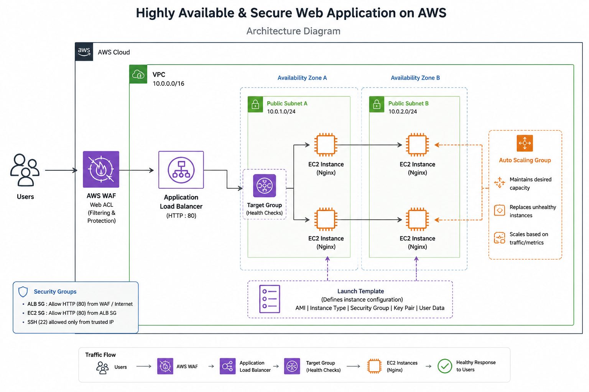
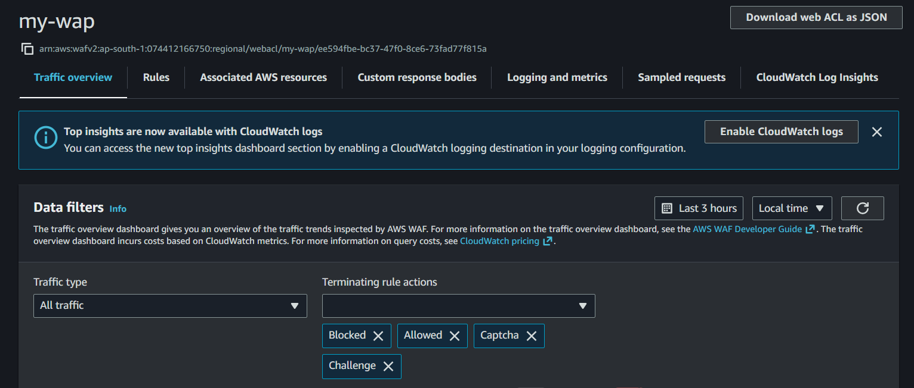
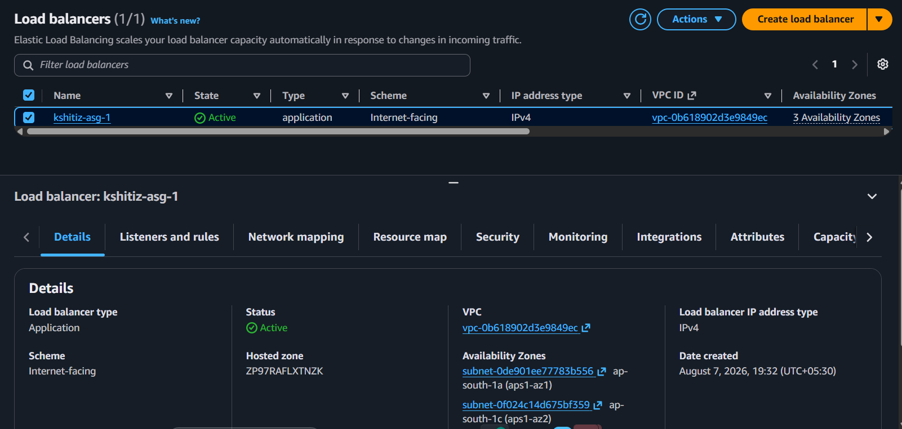
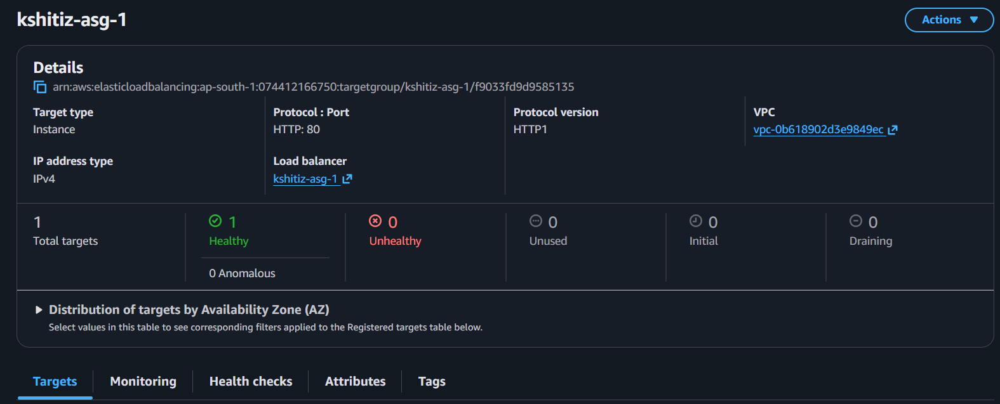
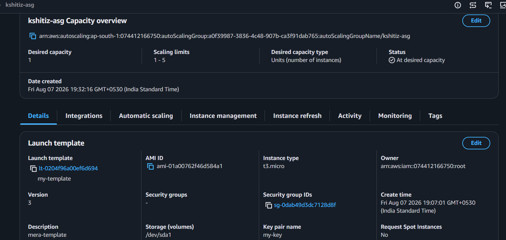
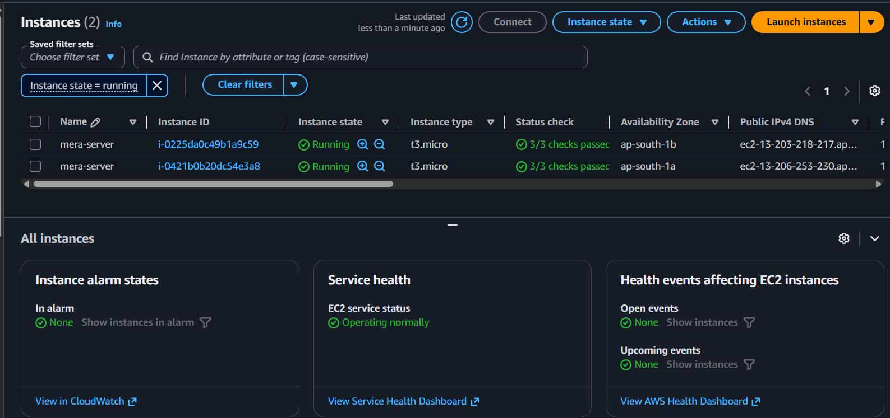

# AWS High Availability Web Architecture

A **highly available, scalable, and secure web application architecture** built on AWS using **EC2, Launch Template, Auto Scaling Group, Application Load Balancer, Target Group, and AWS WAF**.

## Architecture



## Request Flow

```text
User
  ↓
AWS WAF
  ↓
Application Load Balancer
  ↓
Target Group
  ↓
EC2 Instances
  ↓
Nginx Web Application
```

## AWS Services

| Service                       | Purpose                                            |
| ----------------------------- | -------------------------------------------------- |
| **EC2**                       | Hosts the web application                          |
| **Launch Template**           | Defines EC2 instance configuration                 |
| **Auto Scaling Group**        | Maintains and scales EC2 instances                 |
| **Application Load Balancer** | Distributes incoming traffic                       |
| **Target Group**              | Registers EC2 instances and performs health checks |
| **AWS WAF**                   | Protects the application from web-based threats    |
| **Nginx**                     | Serves the web application                         |

## Implementation

### 1. AWS WAF

Configured AWS WAF to provide an additional security layer for the web application.



### 2. Application Load Balancer

Configured an Application Load Balancer to distribute HTTP traffic across multiple EC2 instances.



### 3. Target Group

Created a target group containing the EC2 instances and configured health checks to route traffic only to healthy instances.



### 4. Auto Scaling Group

Configured an Auto Scaling Group to maintain the desired EC2 capacity and support automatic scaling.



### 5. EC2 Instances

Deployed multiple EC2 instances to provide application availability and fault tolerance.



### 6. Web Application

Hosted the web application using Nginx on the EC2 instances.


## Key Features

* High availability
* Load balancing
* Automatic scaling
* EC2 health checks
* Fault tolerance
* Web application security
* Nginx-based web hosting
* Scalable AWS infrastructure

## Project Structure

```text
aws-high-availability-web-architecture/
│
├── screenshots/
│   ├── 01-architecture.png
│   ├── 02-waf.png
│   ├── 03-load-balancer.png
│   ├── 04-target-group.png
│   ├── 05-asg-capacity.png
│   ├── 06-ec2-instances.png
│   └── 07-web-application.png
│
└── README.md
```

## Technologies

**AWS • EC2 • Auto Scaling • Application Load Balancer • Target Groups • AWS WAF • Nginx • Linux**

## Result

Successfully deployed a **highly available and scalable web application on AWS** using multiple EC2 instances behind an Application Load Balancer, with Auto Scaling for scalability and AWS WAF for security.
